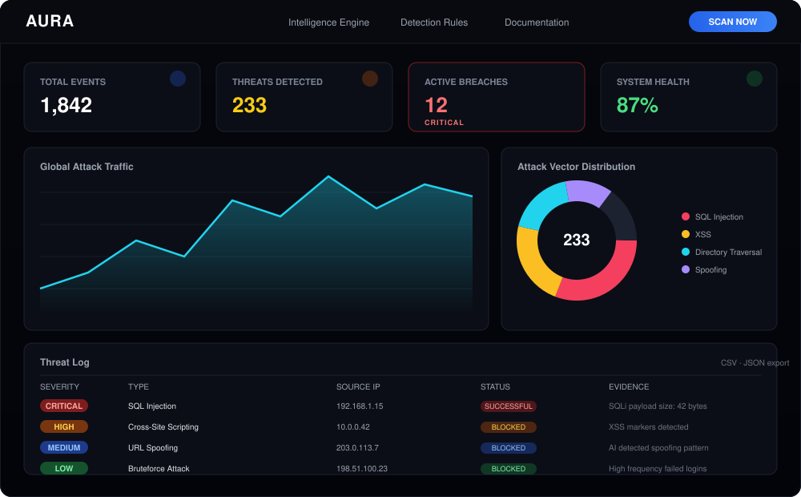
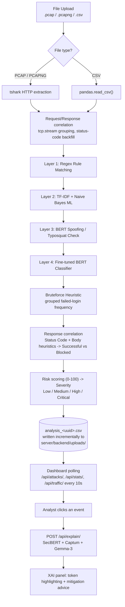
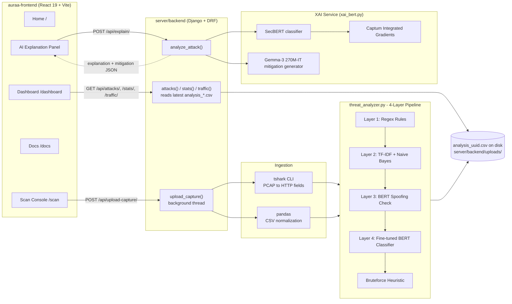

<div align="center">

# 🛡️ AURA
### Advanced URL Response Analyzer

**Forensic-grade PCAP / IPDR analysis that tells you the difference between an attack *attempt* and a *confirmed breach*.**

[](https://react.dev/)
[](https://vite.dev/)
[](https://tailwindcss.com/)
[](https://www.djangoproject.com/)
[](https://www.django-rest-framework.org/)
[](https://pytorch.org/)
[](https://huggingface.co/)
[](https://www.wireshark.org/)

[Repository](https://github.com/FutureAlok1445/sih-aura) · [Application Walkthrough](#-application-walkthrough) · [Architecture](#-system-architecture) · [Getting Started](#-installation)

</div>

<p align="center">
  
</p>

> **What AURA is, in one line:** AURA ingests raw network captures (PCAP/PCAPNG) or HTTP/IPDR-style CSV logs, runs every request through a four-layer detection pipeline (regex rules → machine learning → spoofing detection → a fine-tuned BERT model), correlates each flagged request with the server's actual HTTP response, and shows an analyst a live dashboard that separates **noise (blocked attempts)** from **signal (confirmed breaches)** — with an AI-generated, token-level explanation for every detection.

---

## 📑 Table of Contents

1. [Overview](#-overview)
2. [Application Walkthrough](#-application-walkthrough)
3. [End-to-End Flow](#-end-to-end-flow)
4. [System Architecture](#-system-architecture)
5. [Detection & Analysis Pipeline](#-detection--analysis-pipeline)
6. [Features](#-features)
7. [Technology Stack](#-technology-stack)
8. [Frontend Architecture](#-frontend-architecture)
9. [Backend Architecture](#-backend-architecture)
10. [API Reference](#-api-reference)
11. [Project Structure](#-project-structure)
12. [Installation](#-installation)
13. [Running the Project](#-running-the-project)
14. [How "Confirmed Breach" Detection Works](#-how-confirmed-breach-detection-works)
15. [Security Coverage](#-security-coverage)
16. [Why AURA?](#-why-aura)
17. [Limitations](#-limitations)
18. [Roadmap](#-roadmap)
19. [Contributing](#-contributing)

---

## 🧭 Overview

Traditional WAF/IDS tooling flags a request the moment it *looks* malicious — but a blocked `403` and a successful `200` that leaked data are treated the same way, burying analysts in false positives.

**AURA** takes a different approach: it treats the **server's response** as the source of truth. A SQL injection payload that got a `403 Forbidden` is an *attempt*. The same payload that got a `200 OK` with a large response body is a **confirmed breach**. AURA's backend (`server/backend/api/threat_analyzer.py` and `views.py`) encodes exactly this logic — correlating detected attack payloads with HTTP status codes, response size, and payload-specific heuristics to compute a 0–100 risk score and a `Low / Medium / High / Critical` severity for every event.

On top of that, every detection is explainable: click any flagged request in the dashboard and AURA runs a second AI model (SecBERT + Captum Integrated Gradients) to highlight *which tokens in the URL/payload* drove the decision, then asks a small generative model (Gemma) for two concrete mitigation steps.

---

## 🖥️ Application Walkthrough

AURA is a single-page React app with four routes (`/`, `/scan`, `/dashboard`, `/docs`, plus `/heuristics` which reuses the Docs page). Here's the real user flow, end to end.

### 1. Landing Page — `/` (`src/pages/Home.jsx`)

- **What the user does:** Lands on the animated hero ("Silence the Noise. Confirm the Breach."), scrolls through an "Operational Logic" section (Collect Data → Analyze → Final Decision) and a grid of 11 "Monitored Threats" cards (Typosquatting, SQL Injection, XSS, Directory Traversal, Command Injection, SSRF, LFI/RFI, Credential Stuffing, HTTP Parameter Pollution, XXE, Web Shells).
- **What the system does:** Purely presentational — no API calls happen on this page.
- **What the user sees:** A cinematic, scroll-animated marketing/briefing surface (`ContainerScrollAnimation`, `InteractiveTerminal`, `Spotlight`, `BackgroundBeams`) that sets expectations before they run a real scan.

### 2. Scan Console — `/scan` (`src/pages/Scan.jsx`)

- **What the user does:** Drags & drops (or browses to) a `.pcap`, `.pcapng`, `.cap`, or `.csv` file into the "Forensic PCAP Upload" tab, then clicks **EXECUTE FORENSIC ANALYSIS**. *(A "Live URL Stream" tab exists in the UI but is commented out / disabled in the current code.)*
- **What the system does:** The file is POSTed as `multipart/form-data` to `POST /api/upload-capture/`. The Django view saves it to `server/backend/uploads/`, spins up the analysis in a background Python thread, and returns immediately with `{"status": "processing"}` — the frontend doesn't wait for analysis to finish.
- **What the user sees:** A terminal-styled loading sequence (`SYSTEM_ROOT@AURA:~#`) that plays a short client-side animation ("Initializing smart engine…", "Parsing packet headers…", "Analyzing response signatures…") before redirecting to `/dashboard`.

### 3. Dashboard — `/dashboard` (`src/pages/Dashboard.jsx`)

<p align="center">
  
  <br>
  <sub><em>Stylized layout preview — not a literal screenshot of the running app.</em></sub>
</p>

- **What the user does:** Lands on the results view, which **polls the backend every 10 seconds** so results appear incrementally as each detection layer finishes.
- **What the system does:** Three parallel `GET` calls — `/api/attacks/`, `/api/stats/`, `/api/traffic/` — read the most recently written `analysis_*.csv` on disk. As new detection layers complete, a toast notification ("Machine Learning Analysis Loaded", "Advanced BERT Model Results Loaded", etc.) fires the first time each layer's results appear.
- **What the user sees:**
  - **Stat cards** — Total Events, Threats Detected, Active Breaches (pulses red if > 0), System Health %.
  - **Global Attack Traffic** — a `recharts` `AreaChart` of attacks-per-second (`AttackMap.jsx`).
  - **Attack Vector Distribution** — a `recharts` donut chart of attack-type counts (`ThreatDonut.jsx`).
  - **Threat Log Table** — a searchable, severity-filterable, paginated table (`ThreatLogTable.jsx`) with **CSV and JSON export** buttons that generate files client-side.
  - **Threat Analysis & Mitigation** — a static, per-attack-type mitigation cheat-sheet (`AttackTypeSummary.jsx`).

### 4. Per-Event AI Explanation (in-dashboard)

- **What the user does:** Clicks any row in the Threat Log Table.
- **What the system does:** The frontend POSTs `{ attack_data, attack_type }` to `POST /api/explain/`. The backend runs **SecBERT** through **Captum's Layer Integrated Gradients** to score each token's contribution to the classification, then feeds the top-weighted tokens into **Gemma 3 (270M, instruction-tuned)** to generate two mitigation steps.
- **What the user sees (`AttackExplanation.jsx` + `AttackVisualizer.jsx`):** The raw URL/payload re-rendered with each token color-intensity-coded by importance (darker red = more suspicious), plus a "GEMMA-3 ENHANCED" mitigation callout box.

### 5. Documentation — `/docs` and `/heuristics` (`src/pages/Docs.jsx`)

- **What the user does:** Browses four static topics: Getting Started, PCAP Ingestion, Detection Rules ("Response Analysis Rules"), and API Reference.
- **What the system does:** Nothing — this is static in-app documentation, no backend calls.
- ⚠️ **Accuracy note:** The "API Reference" tab currently shows an illustrative example (`POST /api/v1/scan`) that does **not** match any real backend route. The real, working endpoints are documented below in [API Reference](#-api-reference) — treat the in-app "API Reference" tab as unfinished placeholder copy, not ground truth.

---

## 🔁 End-to-End Flow



Each detection layer only receives the requests the **previous layer left as "Benign"** — this keeps the expensive AI layers (BERT) from re-scoring things regex/ML already caught, and the terminal output prints a running scoreboard for each stage (see `CliTable` in `threat_analyzer.py`).

---

## 🏗️ System Architecture



There is **no database model, no message queue, and no Elasticsearch/Kibana layer** in the current codebase — persistence is a flat CSV file on disk, and background work runs in a plain Python `threading.Thread`, not a task queue. See [Limitations](#-limitations).

---

## 🔬 Detection & Analysis Pipeline

Each layer in `threat_analyzer.py` only processes rows still labeled `"Benign"` after the previous layer, and writes `attack_type`, `evidence`, and `detection_method` back onto the DataFrame — which is what powers the dashboard's "which layer caught this" toast notifications.

| Layer | Technique | Input | What it does |
|---|---|---|---|
| **1 — Regex** | Compiled `re` pattern libraries (14+ pattern groups) | Decoded URL + POST body | Matches Command Injection, SQL Injection, XSS, LFI/Directory Traversal, SSRF, Shell Upload, Null-Byte, NoSQL Injection, LDAP Injection, Buffer Overflow, IDOR, Obfuscation, Unicode/Homograph, and Cache-Poisoning signatures, plus dedicated functions for **HPP** (duplicate query params) and **RFI** (external URLs passed as parameter values) |
| **2 — Machine Learning** | TF-IDF vectorizer + **Naive Bayes** classifier (`ml_predictor.py`, loaded via `joblib`) | URL query string only | Vectorizes the cleaned query string and predicts an attack class; only accepted if confidence ≥ 0.70 |
| **3 — Spoofing Detection** | Fine-tuned BERT prompted with `"analyze domain for spoofing: {url}"`, with a regex fallback list | Full URL | Flags typosquatting/homograph domains (e.g. lookalike `paypa1`, `g00gle`, `faceb00k` patterns), IDN `xn--` domains, embedded-credential URLs (`user@host`) |
| **4 — Deep Learning (BERT)** | Fine-tuned `BertForSequenceClassification` (`bert_predictor.py`), searched for under `server/backend/models/`, falling back to vanilla `bert-base-uncased` if no fine-tuned weights are present | URL path + query (as a sentence pair) | Classifies remaining traffic; accepted only if confidence > 0.85, then double-checked by `validate_prediction()` to reduce SQLi/RFI false positives |
| **Heuristic — Bruteforce** | Frequency analysis (not a model) | Requests to `login`/`signin`/`auth` paths with 4xx/5xx responses | Groups by `(Source_IP, path)`; ≥ 5 failed attempts from the same IP/path is flagged `Bruteforce Attack` |

After classification, `views.py` runs **body-aware, attack-specific evidence extraction** — e.g. for SQL Injection it checks payload byte-size; for XSS it extracts the actual `<script>` tag; for Directory Traversal it looks for `../`, `/etc/passwd`, etc. in the POST body — to decide whether an attack was `"Successful"` or `"Blocked"`, and feeds that into a **risk score** (0–100, from `ATTACK_SEVERITY` + sensitive-path + success + frequency weighting) which maps to `Low / Medium / High / Critical`.

> ⚠️ **Layer 2 in the terminal output is printed as "MACHINE LEARNING (RF)"** but the actual implementation in `ml_predictor.py` loads a **Naive Bayes** model (`naive_bayes_url_model.joblib`), not a Random Forest — this README documents the real implementation.

### Explainability (XAI) sub-pipeline

Triggered separately, on demand, via `/api/explain/`:

1. **SecBERT** (`jackaduma/SecBERT`, loaded as a 7-class sequence classifier) scores the selected payload.
2. **Captum's `LayerIntegratedGradients`** computes per-token attribution against SecBERT's embedding layer, which is normalized, filtered (stop-tokens like `http`, `://`, `[CLS]` zeroed out), and returned as `{token, weight}` pairs.
3. **Gemma 3 (270M, instruction-tuned)** receives the attack type, the payload, and the top 3 highest-weighted tokens, and is prompted to return exactly two mitigation steps.

---

## ✨ Features

### 🔍 Detection
- Four independent, layered detection techniques (regex → ML → spoofing → BERT) plus a bruteforce frequency heuristic
- 19+ distinct attack/anomaly categories recognized by the regex layer alone
- Confidence-gated ML and AI layers to reduce false positives (0.70 / 0.85 thresholds)

### 📊 Analytics & Investigation
- Auto-refreshing dashboard (10-second polling) with layer-completion toast notifications
- Attack-vector distribution donut chart and per-second traffic timeline
- Full-text search + severity filter + pagination on the threat log
- One-click **CSV** and **JSON** export of the currently filtered results

### 🧠 Explainable AI
- Per-event token-importance visualization (SecBERT + Captum Integrated Gradients)
- Generative, context-grounded mitigation advice (Gemma-3 270M-IT)
- Static per-attack-type mitigation knowledge base as an always-available fallback

### 🖥️ Ingestion & Response Correlation
- Accepts `.pcap` / `.pcapng` / `.cap` (via `tshark`) or `.csv` uploads
- Background-threaded analysis so the upload call returns immediately
- Distinguishes a **blocked attempt** from a **confirmed breach** using HTTP status code + attack-specific body heuristics, not just payload matching

---

## 🧰 Technology Stack

| Layer | Technology | Purpose |
|---|---|---|
| Frontend framework | **React 19** + **React Router 7** | SPA with 4 routes (`Home`, `Scan`, `Dashboard`, `Docs`) |
| Build tool | **Vite** (via `rolldown-vite`) | Dev server & bundler |
| Styling | **Tailwind CSS 3.4** + `tailwind-merge` + `clsx` | Utility-first styling and conditional classes |
| Animation | **Framer Motion 12** | Page transitions, terminal typing effect, hover states |
| Charts | **Recharts 3** | Area chart (traffic) and donut chart (attack distribution) |
| File upload UX | **react-dropzone** | Drag-and-drop PCAP/CSV picker |
| Icons | **lucide-react** | Iconography throughout the UI |
| Backend framework | **Django 5.2** + **Django REST Framework** | HTTP API layer |
| Cross-origin support | **django-cors-headers** | Allows the Vite dev server to call the Django API |
| Data processing | **pandas**, **NumPy** | DataFrame-based request analysis pipeline |
| Packet capture parsing | **tshark** (Wireshark CLI, invoked via `subprocess`) | Extracts HTTP fields from PCAP/PCAPNG files |
| Classical ML | **TF-IDF + Naive Bayes** (via `joblib`) | Layer 2 URL-query classifier |
| Deep learning | **PyTorch** + **🤗 Transformers** (`BertForSequenceClassification`) | Layer 3 spoofing check & Layer 4 attack classifier |
| Explainability | **Captum** (`LayerIntegratedGradients`) + `jackaduma/SecBERT` | Token-level attribution for the XAI panel |
| Generative mitigation | **`google/gemma-3-270m-it`** (via `AutoModelForCausalLM`) | Generates 2-step mitigation advice |
| Storage | **SQLite** (Django default) + flat CSV files | SQLite backs Django's own auth/session tables only; scan results are stored as `analysis_*.csv` on disk (no app-level DB models are defined) |

> Note: `three` and `@react-three/fiber` are listed in `auraa-frontend/package.json` but are **not currently imported anywhere** in `src/` — they appear reserved for future 3D visualization work rather than an active feature.

---

## 🧩 Frontend Architecture

```text
auraa-frontend/src/
├── App.jsx                     # Router shell: /, /scan, /dashboard, /docs, /heuristics
├── main.jsx                    # React root
├── pages/
│   ├── Home.jsx                 # Marketing/briefing landing page
│   ├── Scan.jsx                 # Upload console — POSTs to /api/upload-capture/
│   ├── Dashboard.jsx             # Polls /api/attacks/, /api/stats/, /api/traffic/
│   └── Docs.jsx                  # Static docs (4 tabs), reused for /heuristics
├── components/
│   ├── Navbar.jsx                 # Top nav (logo, CyberNav links, "Initialize System" CTA)
│   ├── StatCard.jsx                # Reusable dashboard metric card
│   ├── AttackMap.jsx                # Recharts AreaChart — attacks per second
│   ├── ThreatDonut.jsx               # Recharts PieChart — attack-type distribution
│   ├── ThreatLogTable.jsx             # Search/filter/paginate + CSV/JSON export
│   ├── AttackTypeSummary.jsx           # Static mitigation knowledge base per attack type
│   ├── AttackExplanation.jsx            # Fetches /api/explain/, shows loading + result
│   ├── AttackVisualizer.jsx              # Token-level heat-map rendering (BERT subword merge)
│   └── ui/                                # Design-system primitives (Spotlight, BackgroundBeams,
│                                            # ContainerScrollAnimation, InteractiveTerminal, CyberNav,
│                                            # FluidDropdown, HandWrittenTitle, BackgroundBoxes)
└── lib/utils.js                 # `cn()` class-merging helper
```

State management is intentionally simple: local `useState`/`useMemo`/`useEffect` per page, with `Dashboard.jsx` polling on a `setInterval`. There is no global state library (Redux/Zustand/Context) in the codebase.

---

## 🧱 Backend Architecture

```text
server/backend/
├── core/
│   ├── settings.py               # DEBUG=True, SQLite, CORS allow-list (localhost:5173 only)
│   ├── urls.py                    # Mounts /admin/ and includes api.urls at /api/
│   └── wsgi.py / asgi.py
├── api/
│   ├── urls.py                    # 5 routes — see API Reference below
│   ├── views.py                    # Upload handling, /api/attacks/, /api/stats/, /api/traffic/, /api/explain/
│   ├── parsers.py                   # parse_pcap_tshark(), parse_csv(), parse_xml()
│   ├── threat_analyzer.py            # 4-layer detection pipeline + bruteforce heuristic
│   ├── ml_predictor.py                # TF-IDF + Naive Bayes loader/predictor (Layer 2)
│   ├── bert_predictor.py               # Fine-tuned BERT loader/predictor (Layers 3 & 4)
│   ├── xai_bert.py                      # SecBERT + Captum explanation, Gemma-3 mitigation
│   ├── analyze_capture.py                # Standalone dispatcher (parse → analyze); not wired to a URL route
│   ├── secrets.py                         # Optional local file for HF_TOKEN (gitignored, not present by default)
│   └── models.py                          # Empty — no Django ORM models are defined
├── manage.py
└── db.sqlite3                     # Default Django DB (auth/session/admin tables only)
```

Key implementation details worth knowing:

- **No ORM models.** `api/models.py` is the default Django scaffold with no models added — scan results never touch the database; they live entirely as CSV files under `server/backend/uploads/`.
- **"Latest scan" semantics.** `attacks()`, `stats()`, and `traffic()` all call `_get_latest_csv_path()`, which returns whichever `analysis_*.csv` in `uploads/` was modified most recently — there is no per-session or per-user scoping.
- **Threaded, not queued.** `upload_capture()` starts a daemon `threading.Thread` to run `run_full_analysis()` and returns immediately; there is no Celery/RQ-style task queue.
- **Incremental writes.** `run_full_analysis()` writes the CSV to disk after *each* layer completes, which is what allows the dashboard's 10-second poll to show results appearing progressively.

---

## 🔌 API Reference

All routes are mounted under `/api/` (see `server/backend/api/urls.py`). Base URL in local development is hardcoded in the frontend as `http://127.0.0.1:8000`.

| Method | Endpoint | Purpose |
|---|---|---|
| `POST` | `/api/upload-capture/` | **Main endpoint.** Accepts a `.pcap`/`.pcapng`/`.csv` file (`multipart/form-data`, field name `file`), starts background analysis, returns `{"csv": "...", "status": "processing"}` immediately |
| `GET` | `/api/attacks/` | Returns the detailed row-level results (id, timestamp, IPs, method, URL, attack type, severity, status code, evidence, byte size) from the latest analysis CSV |
| `GET` | `/api/stats/` | Returns dashboard summary numbers: `total`, `threats`, `breaches`, `health`, and a `breakdown` by detection method |
| `GET` | `/api/traffic/` | Returns per-second time-series counts of attack traffic for the area chart |
| `POST` | `/api/explain/` | Accepts `{ "attack_data": "...", "attack_type": "..." }`, returns `{ "explanation": [...], "mitigation": "..." }` from the SecBERT + Captum + Gemma pipeline |
| `POST` | `/api/scan/pcap/` | Minimal test endpoint (`upload_pcap`) that just echoes a success message — present in code but **not called by the frontend** |
| `/admin/` | Django admin | Default Django admin site (no custom models registered) |

### Example: `GET /api/attacks/` record shape

This mirrors the actual fields constructed in `views.py::attacks()` — field names and structure are exact; values below are illustrative only.

```json
{
  "id": 42,
  "timestamp": 1719999999.123,
  "ip": "192.168.1.15",
  "dest_ip": "10.0.0.5",
  "method": "GET",
  "post_body": "",
  "target": "/login.php?id=1' OR '1'='1",
  "type": "SQL Injection",
  "severity": "High",
  "status_code": 200,
  "status": "Successful",
  "result": "Successful",
  "url": "/login.php?id=1' OR '1'='1",
  "evidence": "SQLi payload size: 42 bytes",
  "byte_size": 42
}
```

### Example: `GET /api/stats/` response shape

```json
{
  "total": 1500,
  "threats": 87,
  "breaches": 12,
  "health": 94,
  "breakdown": { "Regex": 60, "ML": 15, "Spoofing": 4, "AI": 8 }
}
```

> No accuracy, precision, recall, or latency benchmarks exist anywhere in this repository — the API returns operational counts and confidence scores per prediction, not model evaluation metrics, so none are claimed here.

---

## 🗂️ Project Structure

```text
sih-aura/
├── README.md
├── auraa-frontend/
│   ├── package.json                # React 19, Vite, Tailwind, Recharts, Framer Motion...
│   ├── vite.config.js
│   ├── tailwind.config.js
│   ├── index.html
│   ├── public/
│   │   └── vite.svg
│   └── src/
│       ├── App.jsx
│       ├── main.jsx
│       ├── pages/                  # Home, Scan, Dashboard, Docs
│       ├── components/             # StatCard, AttackMap, ThreatDonut, ThreatLogTable, ...
│       │   └── ui/                 # Reusable animated UI primitives
│       └── lib/utils.js
└── server/
    └── backend/
        ├── manage.py
        ├── db.sqlite3
        ├── requirements.txt        # ⚠️ currently empty — see Installation
        ├── core/                   # Django project (settings, urls, wsgi/asgi)
        └── api/                    # Django app: views, parsers, ML/BERT/XAI logic
```

---

## ⚙️ Installation

### Prerequisites

| Requirement | Why |
|---|---|
| **Node.js 18+ / npm** | Build & run `auraa-frontend` |
| **Python 3.11** | Run the Django backend (compiled `.pyc` files in the repo target `cpython-311`) |
| **tshark** (part of [Wireshark](https://www.wireshark.org/)), on your `PATH` | Required only for `.pcap`/`.pcapng` uploads — CSV uploads work without it |
| *(Optional)* CUDA-capable GPU | Speeds up BERT / SecBERT / Gemma inference; everything also runs on CPU (slower) |
| *(Optional)* Hugging Face token | For downloading gated/rate-limited models used in `xai_bert.py` |

### Backend Setup

```bash
cd server/backend
python -m venv venv
source venv/bin/activate      # on Windows: venv\Scripts\activate
```

`server/backend/requirements.txt` is **currently empty** in this repository, so dependencies must be installed manually based on the actual imports in the codebase:

```bash
pip install django djangorestframework django-cors-headers pandas numpy joblib \
            torch transformers captum huggingface_hub tqdm
```

```bash
python manage.py migrate
python manage.py runserver
```

The API will be available at **`http://127.0.0.1:8000/`**.

### Frontend Setup

```bash
cd auraa-frontend
npm install
npm run dev
```

The app will be available at Vite's default dev URL, typically **`http://localhost:5173/`**.

### Configuration Notes (read before running)

- **No `.env` / `.env.example` exists in this repository.** Configuration is currently hardcoded:
  - `server/backend/core/settings.py` → `CORS_ALLOWED_ORIGINS` only permits `http://localhost:5173` and `http://127.0.0.1:5173`.
  - `Scan.jsx`, `Dashboard.jsx`, and `AttackExplanation.jsx` each hardcode the API base URL as `http://127.0.0.1:8000`. To point the frontend at a different backend, these files need to be edited directly (or refactored to use a single config/env value).
- **Hugging Face token:** `xai_bert.py` looks for `HF_TOKEN` first in a local, gitignored `server/backend/api/secrets.py` file (`HF_TOKEN = "hf_..."`), then falls back to an `HF_TOKEN` environment variable.
- **ML model artifacts are not bundled.** Layer 2 (`ml_predictor.py`) expects `server/backend/ml_model/naive_bayes_url_model.joblib` and `.../tfidf_vectorizer.joblib`; `**/ml_model` is gitignored. Without these files, Layer 2 always returns `"Benign"` with an `"ML Model Missing"` note.
- **Fine-tuned BERT weights are not bundled.** Layers 3 & 4 (`bert_predictor.py`) recursively search `server/backend/models/` for `model.safetensors`/`pytorch_model.bin`; `**/models` is gitignored. Without a fine-tuned checkpoint, the app silently falls back to vanilla `bert-base-uncased`, which is **not** trained for attack/spoofing classification.
- `server/backend/uploads/` (input files + `analysis_*.csv` results) and any `logs/` directory are created at runtime and are gitignored.

---

## ▶️ Running the Project

```bash
# Terminal 1 — Backend (Django API)
cd server/backend
source venv/bin/activate
python manage.py runserver
# → http://127.0.0.1:8000/

# Terminal 2 — Frontend (React + Vite)
cd auraa-frontend
npm run dev
# → http://localhost:5173/
```

If you plan to upload `.pcap`/`.pcapng` files, make sure `tshark` is installed and resolvable on your `PATH` (verify with `tshark -v`) — `.csv` uploads do not require it.

---

## 🕵️ How "Confirmed Breach" Detection Works

**Simple explanation:** Most tools tell you *"this looked like an attack."* AURA also tells you *"...and here's whether it actually worked."* It does this by looking at what the server sent back, not just what the attacker sent.

**Technical explanation:** After the 4-layer pipeline assigns an `attack_type` to a request, `views.py::attacks()` runs a second, attack-type-specific pass over the row:

- **SQL Injection:** flags `"Successful"` if the payload's byte size exceeds a threshold (heuristic proxy for a data-bearing response), else `"Blocked"`.
- **XSS:** extracts the actual `<script>...</script>` fragment from the POST body if present (`"Successful"`), otherwise just notes markers were seen (`"Blocked"`).
- **Directory Traversal:** searches the body for `../`, `..\`, `%2e`, `/etc/passwd`, `C:\windows\system32`, etc.
- **Web Shell Upload:** treats `POST`/`PUT` requests with a body over 10 bytes as a likely successful upload.
- **Everything else:** falls back to a general rule — HTTP `2xx` = `"Successful"`, `0`/unknown = `"Unknown"`, anything else = `"Blocked"`.

That `"Successful"`/`"Blocked"` outcome then feeds `_risk_score()`, which starts from a per-attack-type base severity (`ATTACK_SEVERITY` dict), adds +15 if the URL touches a sensitive path (`login`, `admin`, `wp-admin`, `phpmyadmin`, ...), +15 if the attack was `"Successful"`, and +10 for high-frequency attempts — capped at 100 — before mapping to `Low (≤25) / Medium (≤50) / High (≤75) / Critical (>75)`.

---

## 🔒 Security Coverage

| Threat | Detected by | AURA's outcome |
|---|---|---|
| SQL Injection | Regex (`UNION SELECT`, `information_schema`, `OR 1=1`, ...) → ML → BERT | Confirmed if payload body size suggests a data-bearing response |
| Cross-Site Scripting (XSS) | Regex (`<script>`, `on*=`, `javascript:`, ...) | Confirmed if a real `<script>` fragment is recovered from the body |
| Command Injection | Regex (`;`/`\|`/`&&` + shell binaries, `cmd.exe`, `powershell`, backticks) | Flagged by pattern match; severity weighted highest in `ATTACK_SEVERITY` |
| Directory Traversal / LFI | Regex (`../`, `/etc/passwd`, `php://filter`, ...) | Confirmed if traversal strings are found in the request body |
| Remote File Inclusion (RFI) | Custom `detect_rfi()` — external URL passed as a `file`/`page`/`include`/etc. parameter | Flagged, excluding localhost/private-IP targets |
| SSRF | Regex against internal/metadata IP ranges (`127.0.0.1`, `169.254.169.254`, `10.x`, `192.168.x`, `gopher://`, `dict://`) | Flagged by pattern match |
| XXE | Regex (`<!ENTITY`, `<!DOCTYPE`, `SYSTEM "..."`) triggered only when XML content is present | Flagged by pattern match |
| Web Shell Upload | Regex on filenames/content-types (`.php`, `.jsp`, `.aspx`, known shell names) | Confirmed if method is `POST`/`PUT` with a non-trivial body |
| HTTP Parameter Pollution | `detect_hpp()` — duplicate query/body keys with differing values | Flagged with the offending parameter name |
| NoSQL / LDAP Injection, Buffer Overflow, IDOR, Obfuscation, Unicode/Homograph, Cache Poisoning | Dedicated regex pattern groups | Flagged by pattern match |
| URL Spoofing / Typosquatting | Fine-tuned BERT prompt + curated lookalike-domain regex list | Flagged if AI confidence > 0.85 or a regex match hits |
| Bruteforce / Credential Stuffing | Frequency heuristic on failed logins grouped by `(IP, path)` | Flagged at ≥ 5 failed attempts |

This list reflects exactly what `threat_analyzer.py` checks for today — no additional attack classes are claimed.

---

## 💡 Why AURA?

- **Response-aware, not just request-aware.** The core differentiator: severity and "breach" status are derived from what the server actually did, not just what was sent.
- **Layered, not monolithic.** Cheap, fast regex rules run first; expensive AI models only see traffic the earlier layers couldn't explain — a practical way to combine deterministic rules with ML/DL without paying the AI cost on every request.
- **Explainability is built in, not bolted on.** The dashboard doesn't just say "SQL Injection" — clicking an event shows *which tokens* triggered that call and *why*, backed by real gradient-based attribution (Captum), not a canned description.
- **Analyst-friendly investigation surface.** Searchable/filterable table, exportable evidence (CSV/JSON), and a live-updating view all live in one dashboard, rather than requiring analysts to correlate raw logs by hand.

---

## ⚠️ Limitations

- **No trained model artifacts ship with the repo.** `ml_model/` and `models/` are gitignored — out of the box, Layer 2 (Naive Bayes) and Layers 3–4 (fine-tuned BERT) either return `Benign` or silently fall back to an untrained `bert-base-uncased`, meaning real detection accuracy depends entirely on models you train/supply yourself.
- **Single "latest scan" state, no multi-user isolation.** `/api/attacks/`, `/api/stats/`, and `/api/traffic/` always read the most recently modified CSV in `uploads/` — two people scanning at the same time will see each other's results overwrite theirs.
- **No persistence layer.** There are no Django models; results exist only as CSV files on disk, with no scan history browser beyond "whatever finished most recently."
- **No authentication or authorization** on any API route, file upload, or the Django admin panel.
- **Hardcoded network configuration.** API base URL (frontend) and CORS allow-list (backend) are hardcoded to `localhost`, not environment-driven.
- **Threaded, not queued background processing.** A raw Python `threading.Thread` runs each analysis job — not crash-resilient or horizontally scalable like a Celery/RQ-based worker pool.
- **PCAP parsing requires the external `tshark` binary**; there's no pure-Python fallback if it isn't installed.
- **The ML layer only inspects the URL query string** — not headers, full POST bodies (for classification purposes), or multi-request session context.
- **False-positive validation is narrow.** `validate_prediction()` in `bert_predictor.py` only sanity-checks the RFI and SQL Injection labels explicitly; other AI-flagged labels aren't cross-validated.
- **Model downloads at runtime.** SecBERT and Gemma-3 are pulled from Hugging Face on first use (not vendored), so first-run latency, disk usage, and (for gated/rate-limited models) a valid `HF_TOKEN` all matter.
- **Not production-hardened.** `DEBUG = True` and a hardcoded Django `SECRET_KEY` are present in `core/settings.py`.
- **`requirements.txt` is empty**, so backend dependencies aren't pinned or reproducible from the repo alone.
- **`three` / `@react-three/fiber` are installed but unused** in the current frontend source.

---

## 🛣️ Roadmap

**✅ Implemented**
- 4-layer detection pipeline (regex → Naive Bayes ML → BERT spoofing check → fine-tuned BERT)
- Bruteforce/credential-stuffing frequency heuristic
- PCAP (via `tshark`) and CSV ingestion with background-threaded analysis
- Response-correlated "confirmed breach vs. blocked attempt" classification
- 0–100 risk scoring with Low/Medium/High/Critical severity mapping
- Polling dashboard with stat cards, traffic timeline, and attack-distribution donut
- Searchable/filterable/paginated threat log with CSV/JSON export
- Per-event XAI explanation (SecBERT + Captum) with Gemma-3-generated mitigation advice

**🚧 In Progress / Partial**
- Fine-tuned Naive Bayes and BERT model weights (pipeline code is complete; trained artifacts are not bundled in the repo)
- "Live URL Stream" scanning tab (UI markup exists in `Scan.jsx` but is commented out)
- In-app "API Reference" documentation tab (currently shows placeholder content that doesn't match the real API)

**🔭 Future (ideas only — not present in the codebase today)**
- Environment-based configuration (`.env`) instead of hardcoded hosts/CORS origins
- Persistent, database-backed scan history with multi-scan comparison
- Authentication/RBAC for the dashboard and API
- A task queue (Celery/RQ) for scan processing instead of raw threads
- Long-term storage/search backend (e.g. Elasticsearch) for large-scale log retention, if the project grows beyond single-file analysis
- Containerized deployment (Docker Compose for frontend + backend + model storage)

---

## 🤝 Contributing

```bash
# 1. Fork the repository, then clone your fork
git clone https://github.com/<your-username>/sih-aura.git
cd sih-aura

# 2. Create a feature branch
git checkout -b feature/your-feature-name

# 3. Install dependencies (see Installation above for both frontend and backend)

# 4. Make your changes, then lint the frontend
cd auraa-frontend
npm run lint

# 5. (Backend) run Django's test runner — no tests are currently written, but the scaffold exists
cd ../server/backend
python manage.py test

# 6. Commit, push, and open a Pull Request against the main repository
git add .
git commit -m "feat: describe your change"
git push origin feature/your-feature-name
```


